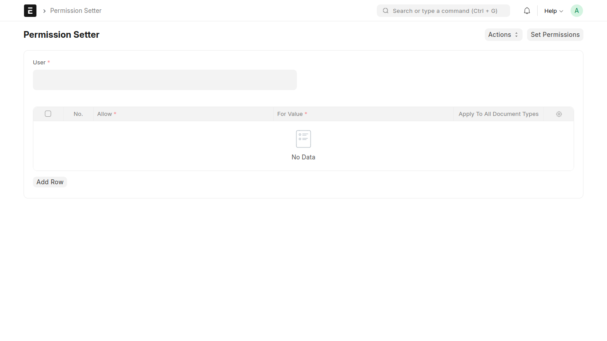
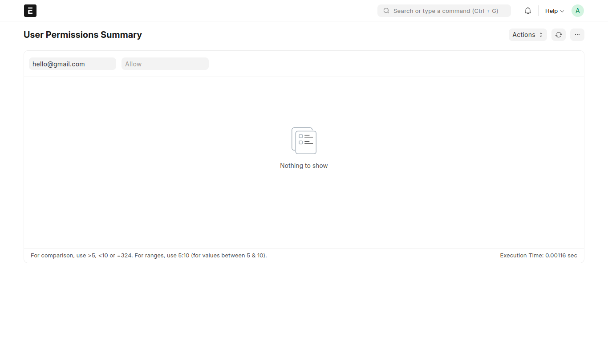

<div align="center" markdown="1">
	
	<h1>BULKi</h1>

**Fast and Easy Bulk Management of User and Role Permissions**
</div>

<div align="center">
	<a target="_blank" href="#LICENSE" title="License: MIT"></a>
</div>
<div align="center">
	
</div>


## Bulki
Open-source Frappe-based application designed to streamline and simplify the bulk management of user and role permissions. Built with efficiency and precision in mind, Bulki allows you to handle access control tasks in bulk, reducing time and effort while maintaining accuracy.

## Motivation

The idea for Bulki originated while working on a project that required extensive user permission management. Setting permissions one by one proved to be a tedious and time-consuming process. To address this challenge, I developed Bulki—a tool that automates and accelerates bulk operations for user and role permissions. Now, it’s free, open-source, and ready to make your work easier.

## Key Features

- **Bulk User Permission Setup**: Assign permissions to multiple users at once, saving time and effort.

- **Permission Cloning**: Quickly clone another user’s permissions to a new user, ideal for scenarios where similar roles are required.

- **Bulk Deletion of Permissions**: Remove user permissions in bulk instead of deleting them one by one.

- **Comprehensive Reports**: View all users and their respective permissions in a detailed report. Filter data by user or permission to see only the information you need.

<div align="center">
	
</div>


## Use Case

- **Team Setup**: Easily onboard a new team member by cloning an existing user's permissions.

- **Access Updates**: Modify or revoke permissions for multiple users simultaneously during organizational changes.

- **Permission Audits**: Use the built-in report to audit user permissions, ensuring compliance and clarity.

## Installation

1. Install the app in your Frappe site:

   ```bash
   bench get-app https://github.com/ajayraj5/bulki.git
   bench install-app bulki
   ```

3. Start your Frappe server and access the app via the desk interface.


## Future Enhancements

I’m always looking for ways to improve Bulki. If you have ideas for additional bulk operations in Frappe, feel free to share them! Submit your suggestions via [GitHub Issues](https://github.com/ajayraj5/bulki/issues), and I’ll explore adding them to the app.

## Contributing

Contributions are welcome! To get started:

1. Fork the repository.
2. Create a new branch for your feature or bug fix.
3. Submit a pull request with a clear description of your changes.

## Acknowledgements

Built with love in India by **AjayRaj Mahiwal**. Special thanks to the Frappe community for providing the tools and inspiration to build this app.

## License

This project is licensed under the MIT License. See the [LICENSE](https://github.com/ajayraj5/bulki/blob/develop/license.txt) file for more details.

---